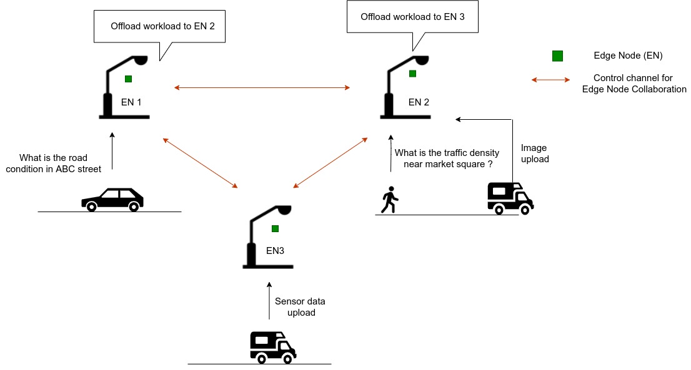
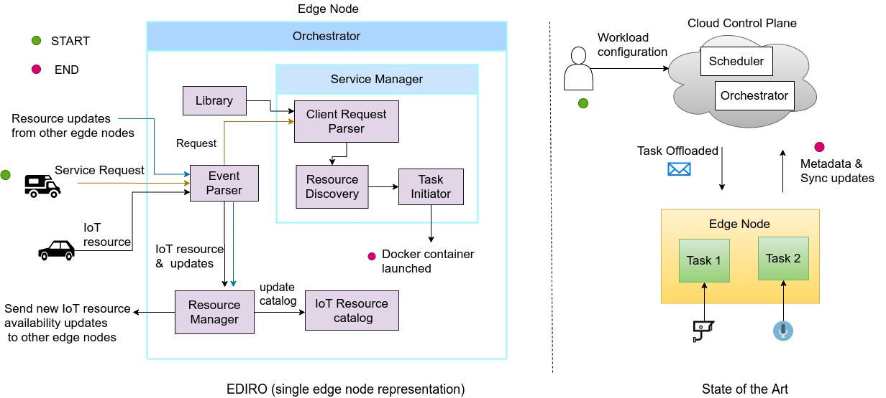
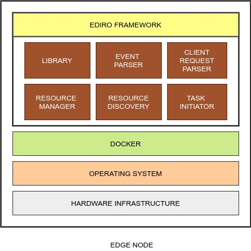

# EDIRO

EDIRO is an Edge-driven IoT Resource-aware Orchestration Framework for Edge Computing. It enables an edge infrastructure comprising of a cluster of interconnected edge nodes to operate as an autonomous entity with minimal or no dependence on the cloud. The development of EDIRO is a means to experimentally evaluate the proposal of an edge-driven architecture for edge computing that aims to overcome the shortcomings of the existing approaches of utilizing edge computing for IoT. Please refer the [EDIRO paper](https://dl.acm.org/doi/abs/10.1145/3360468.3368179) for more details on this proposal and the description of the system architecture of EDIRO.

## Overview

EDIRO is specifically designed for utilization in IoT use cases characterized by client requests that request on-demand services from the edge infrastructure. The target use case dealt with in this regard is that of connected vehicles, where mobile clients, i.e., vehicles, demand  provisioning of ephemeral workloads on the edge servers. These workloads require an input or an 'IoT resource' to execute upon and render the desired results. EDIRO facilitates collaborative processing by enabling the network of edge nodes to source these IoT resources from other clients in the vicinity that may contribute them, as shown in the figure below. In a typical connected vehicles scenario, a vehicle’s query about the condition of the road ahead of it is serviced by executing a workload on the nearby edge compute node installed on a traffic light that utilizes the input, i.e., high definition (HD) maps and sensor data offloaded on it by other vehicles in the vicinity.     

EDIRO approaches the design and operation of an edge computing infrastructure in a bottom-up fashion as opposed to the typical top-down strategy in the existing approaches which ignores the interactions of the end users with the edge infrastructure and the related context information. This is represented in the below figure which compares EDIRO with the existing IoT edge computing approaches in order to exhibit the benefits EDIRO provides.

## System Architecture

EDIRO is composed of multiple independent modules as shwon in the figure below that function concurrently to perform workload orchestration for client requests and collectively provide its three main functionalities, i.e., resource management, service management and event parsing. EDIRO is designed and implemented as an event-driven architecture. The modules constituting EDIRO listen for events and act in response to deliver their respective functionality. The key events that trigger the system software of EDIRO are the end user interactions at the edge nodes that correspond to either offload of IoT resources or arrival of on-demand client requests. EDIRO is designed to run on a single edge node and facilitate distribued orchestration when multiple edge nodes running an identical instance of EDIRO exists in an interconnected network.

## System requirements for build and execution

EDIRO requires the following to be installed on the host machine.

- [A working Golang environment](https://golang.org/doc/install)
- [Docker Communty Edition](https://docs.docker.com/install/linux/docker-ce/ubuntu/)
- [gRPC and protoc plugin for Golang](https://grpc.io/docs/quickstart/go/)

EDIRO is tested fine on Ubuntu 18.04 LTS.

## Usage

### Setup

EDIRO is a distributed orchestration framework that enables multiple edge nodes to collaborate and carry out the service orchestration. Hence, as a prerequisite to test EDIRO, a cluster of interconnected computing devices or edge nodes needs to be initialized. The following is required.

- Two or more Linux hosts with Docker installed that can communicate over a network with each other.
- IP address and port number details of each edge node.

To setup the edge cluster, follow the below steps.

- Initialize docker swarm on any one of the edge nodes using the command `docker swarm init`
- Generate token to enable other edge nodes to join this swarm cluster as manager nodes using the command `docker swarm join-token manager ` 
- Execute the generated token command on each of the other edge nodes.

At this stage a cluster of interconnected edge nodes has been etsablished. In order to identify each edge node specifically, labels need to be assigned to each of them. Use the below command to add a label to each edge node. 

`docker node update --label-add device=<edge_node_label> <device_username>`

In the above command the field <edge_node_label> can be populated with the desired label. The field <device_name> specifies the username of the device and is fixed for a particular device.

### Input specification

EDIRO is designed to react to and process the interactions that the end users have with the edge infrastructure in real life IoT scenarios. These interactions are the on-demand service requests and IoT resource offloads. In a practical scenario the end users can directly offload their service requests or contribute IoT resources via appropriate means of wireless or wired networking. However,  at the current stage of development of this project, the end user interactions at the edge nodes are simulated by representing them in a JSON format in a file and supplying it as an external input to EDIRO during testing. Two separate files for each edge node are used for this purpose which can be modified as per the following details.

- input.json : It represents the IoT resources offloaded on the edge nodes. Use the edge node labels created earlier to distribute the IoT resources among different edge nodes. An example is shown in the file already.

- clientrequest.json represents the incoming client request on the edge nodes.

Each edge node must be populated with a set of containerized application images that must be deployed to serve these client requests. EDIRO utilizes an imperative approach to map the client requests with the workload to be deployed on the edge nodes and express the relation between the applications and the associated IoT resources. Make changes to the file library.go capturing the modifications in the input files to ensure consistency of mapping between the client requests and the workload applications and also between the workload applications and IoT resources. 

### Compilation and Execution

Use the below commands to compile the above changes and create an executable binary on each edge node which can be executed independently :

- `go build`
- `go install <path to EDIRO directory>`
